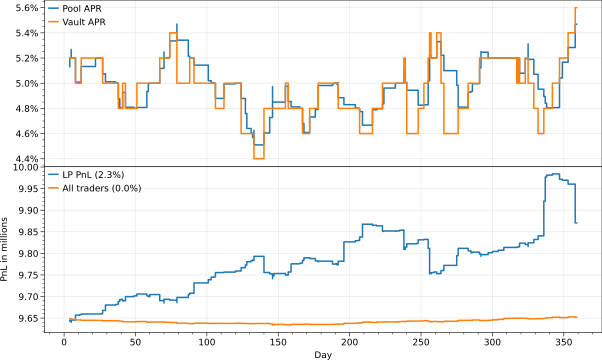
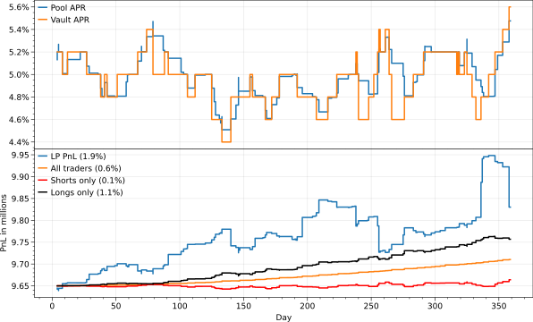
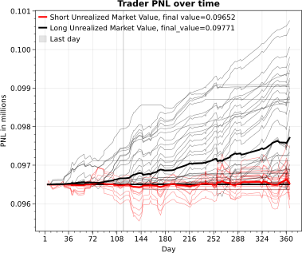
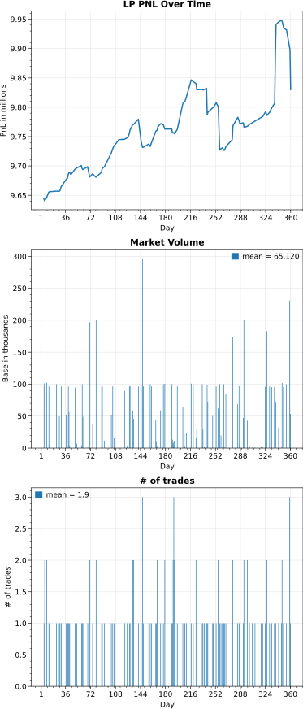

Vault tracker
=============
| let's look at a **starting scenario** with 10% trade and 0.05% redemption fees
| other defaults: 100 agents, 50 long, 50 shorts, trading ~2x per 1 year simulation,
| 9.65M initial liquidity, 5% initial APR, 0.2% APR jumps, 100 jumps per year
| 9.65M split across all traders evenly

|   :width: 1000
| uWu what's this? the LPs are making **TOO MUCH MONEY?!@?#!** 😱
| 
let's introduce **rent control** and  see what happens when we set the fees to zero 🤪
| also let's look at the traders in more detail, and break them out between longs and shorts

|   :width: 1000

|   :width: 1000

|   :width: 1000
